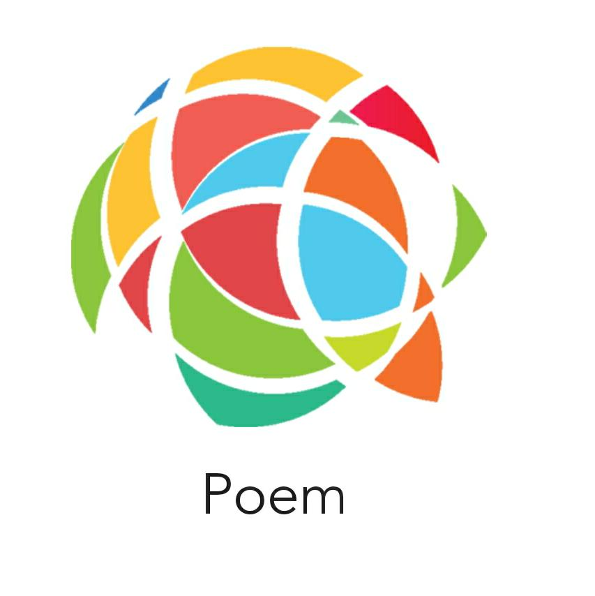
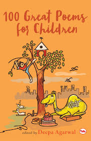
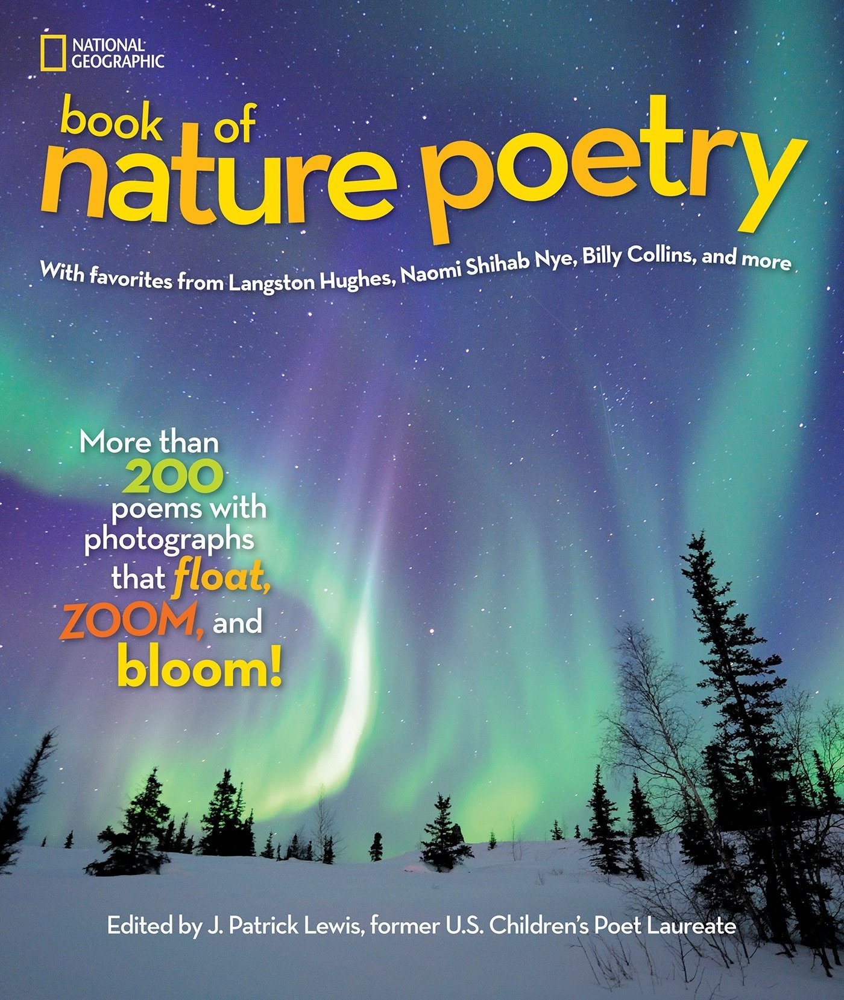
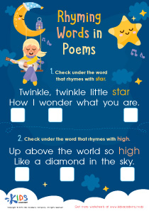

# PoemWebsite
<html>
<link rel ="stylesheet" type="text/css" href="css/stylesheet.css">
</head>
<body>
<header>

<ul>
<li><a href ="home.html">Home</a></li>
<li><a href ="category.html">Category</a></li>
<li><a href ="SignUp.html">Signup</a></li>
</ul>

<h1>Sign UP</h1>
<form>
<label>Full name:</label>
<input type="textfield"   name="tb1" placeholder="Full Name" id="fullname"> 
 
<label> Password :</label>
<input type="password"  name="pwd"  placeholder="Password"id="pwd"> 
 
<label>Address :</label>
<textarea cols="20" rows="1" placeholder="Address" ></textarea>  
 
<label>Gender :</label>
<input type="radio"name="rb1">MALE
<input type="radio"name="rb1">FEMALE 
 

<button onclick="myFunction()">Sign up</button>

</form>
</body>
</html>

</header>
</body>
</html>
</html> 
 BIN +28.9 KB 
book.jpg

 80  
category.html
@@ -0,0 +1,80 @@
<html>
<head>
<link rel ="stylesheet" type="text/css" href="css/style.css">
</head>
<body>
<header>

<ul>
<li><a href ="home.html">Home</a></li>
<li><a href ="category.html">Category</a></li>
<li><a href ="SignUp.html">Signup</a></li>
</ul>
<h1>Category</h1>
 
 

</head>
<body>

  
  
All Inspiring ones are here displayed 

  
  
Poems for age group 8 to12

  
  
Beautifull poems about nature

  
  
Great Rhymming poems are here

.

</header>
</body>
</html> 
 40  
css/style.css
@@ -0,0 +1,40 @@
{
padding:0;
margin:0;
font-family:' Josefin Sans,sans-serif';
box-sizing:bordrer-box;
}
.logo{
margin:left;
border-radius: 80px;
}
header {
              background-image: url(../gh.png );
             height:100%;
             background-size:cover;
             background-position:center;

}
ul{
float:right;
list-style-type:none;
}
h1{
text-align: center;
color:white;
}
ul li{
display:inline-block;
}
ul li a{
text-decoration:none;
color:white;
padding:5px 20px;
border:1px solid grey;
transition: 0.6ease;
justify-content:space-around;
}
ul li a:hover{
background-color: #fff;
color:#000;
} 
 59  
css/stylesheet.css
@@ -0,0 +1,59 @@
{
margin:0;
padding:0;
}
header {
              background-image: url(../book.jpg );
             height:100%;
             background-size:cover;
             background-position:center;

}
ul{
float:right;
list-style-type:none;
top: 100px;
}
ul li{
display:inline-block;
}
ul li a{
text-decoration:none;
color:#fff;
padding:5px 20px;
border:1px solid white;
transition: 0.6ease;
}
ul li a:hover{
background-color: #fff;
color:#000;
}
.title{
position:absolute;
top:50%;
left:50%;
transform:translate(-50%,-50%);
}
.title h1{
color:#fff;
}
.sign-up-form{
width:300px;
font-size:14px;
border radius:10px;
box-shadow:0 0 3px 0 rgba(0,0,0,0.5);
background-color:rgba(0,0,0,0.5);
color:#fff;
padding:0px;
margin:8% auto 0;
text-allign:center;
}
form#signup{
     margin: 40px; 
}
p{
color:#fff;
}

 BIN +2.62 MB 
gh.png

 29  
home.html
@@ -0,0 +1,29 @@
<html>
<head>
<title> Poems Website </title>
<link rel ="stylesheet" type="text/css" href="css/stylesheet.css">
</head>
<body>
<header>

   
<ul>
<li><a href =#>Home</a></li>
<li><a href ="category.html">Category</a></li>
<li><a href ="SignUp.html">Signup</a></li>
</ul>

<h1> World Of Poems</h1>

Experience different types of poems in the world of poems . A new different era for poems organised and designed for user friendly interface

Welcome to the interface!!!

<button type="button" onclick="document.getElementById('demo').style.display='block'">Click Me!</button>
<button type="button" onclick="document.getElementById('demo').style.display='none'">Hide!</button>

</header>
</body>
</html> 
 BIN +14.9 KB 
images.jfif
Binary file not shown.
 BIN +267 KB 
ip.jpg

 BIN +29.3 KB 
lo.jfif
Binary file not shown.
 BIN +564 KB 
np.jpg

 BIN +39.2 KB 
rp.jpg

 40  
style.css
@@ -0,0 +1,40 @@
{
padding:0;
margin:0;
font-family:' Josefin Sans,sans-serif';
box-sizing:bordrer-box;
}
.logo{
margin:left;
border-radius: 80px;
}
header {
              background-image: url(../gh.png );
             height:100%;
             background-size:cover;
             background-position:center;

}
ul{
float:right;
list-style-type:none;
}
h1{
text-align: center;
color:white;
}
ul li{
display:inline-block;
}
ul li a{
text-decoration:none;
color:white;
padding:5px 20px;
border:1px solid grey;
transition: 0.6ease;
justify-content:space-around;
}
ul li a:hover{
background-color: #fff;
color:#000;
} 
